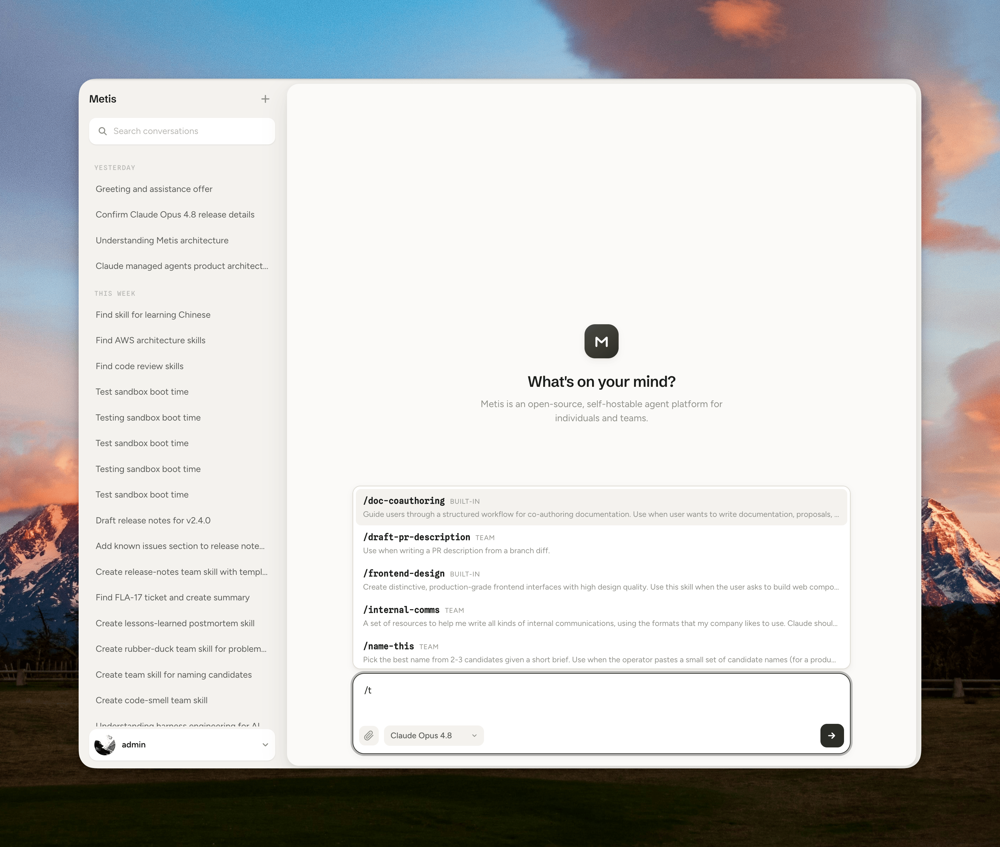

# Metis

[](https://github.com/chagel/metis/actions/workflows/ci.yml)
[](LICENSE)
[](https://github.com/chagel/metis/pulls)

**pi runs on your laptop. Metis runs pi for everyone you work with —
in a sandbox, on your stack, with your provider.**

An open, self-hostable agent platform built on **pi**, a fast, open
agent harness. Streaming web chat, multi-user from day one, the agent
sandboxed by default. Coding is one capability, not the boundary.



- **[`VISION.md`](VISION.md)** — what Metis is, the rules we hold to, what we won't build.
- **[`PLAN.md`](PLAN.md)** — current status, roadmap, and open questions.
- **[`docs/architecture.md`](docs/architecture.md)** — how a turn flows; the Agent service layer.
- **[`docs/configuration.md`](docs/configuration.md)** — runtimes, providers, and environment.
- **[`docs/`](docs/)** — tenancy, connectors, session persistence, identity, skills.

## Stack

- **Rails 8.1**, Ruby 4.0.5, PostgreSQL
- **pi** agent harness, driven via the [`pi-agent-rb`](https://github.com/chagel/pi-agent-rb) gem
- **Any LLM provider [pi supports](https://pi.dev/docs/latest/providers)**, chosen per conversation
- **Hotwire** (Turbo + Stimulus, importmap) and **Tailwind** for the live chat UI
- **Devise** for auth; **Solid Queue / Cache / Cable** for jobs, cache, and Action Cable

## Quickstart

Prerequisites: **Ruby 4.0.5** (see `.ruby-version`; `mise` recommended),
**PostgreSQL**, and **pi** on your `PATH` for the default `local` runtime
(`npm install -g @earendil-works/pi-coding-agent`).

```sh
bin/setup        # install deps, prepare the database, install the MCP bridge into pi
bin/dev          # Puma + Tailwind via foreman → http://localhost:3000
```

Set at least one provider key (e.g. `ANTHROPIC_API_KEY`) in `.env` —
`bin/dev` loads it via foreman. See
[`docs/configuration.md`](docs/configuration.md) for runtimes,
providers, and every variable.

> Metis encrypts `Message#content` and `Message#reasoning` with Active
> Record Encryption; the keys must be present in Rails credentials for
> every environment, tests included.

## Development

```sh
bin/rails test   # full Minitest suite
bin/rubocop      # lint (rubocop-rails-omakase)
bin/ci           # rubocop, security scans, and tests
```

See [`docs/architecture.md`](docs/architecture.md) and
[`CLAUDE.md`](CLAUDE.md) for architecture and conventions.
